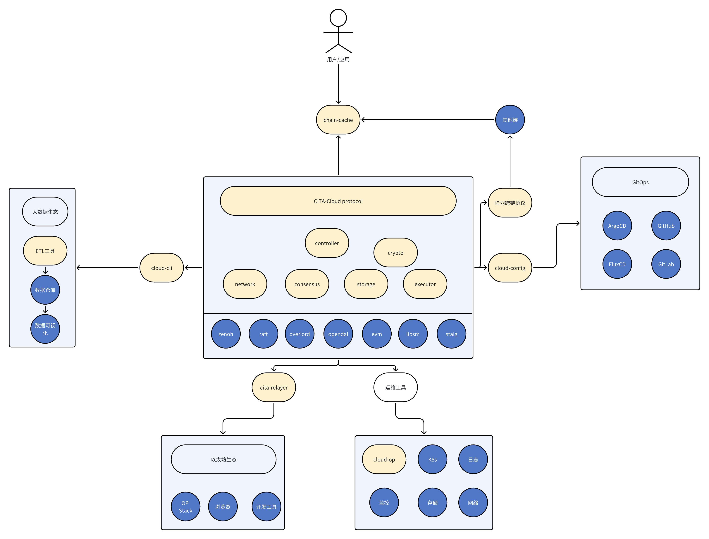
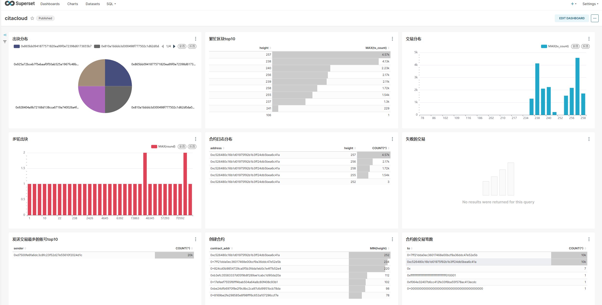

# 生态

`CITA-Cloud`定位于开源的云原生区块链框架，因此在积极推进区块链生态和云原生社区的融合。

原因有：

1. 联盟链是面向企业市场的，没有公链项目`To C`的特点和经济激励。因此在生态参与的人数，传播度，投入资源方面都没有优势，无法独立打造一个生态，需要拥抱已有的成熟生态。
2. 联盟链是面向企业市场的，没有公链那么强的去中心化诉求。在技术上和云原生社区有比较多契合的地方。

*CITA-Cloud生态全景图（右键---"在新标签页中打开图像"查看大图）*

*图中背景为黄色的组件为CITA-Cloud自身设计开发，背景为蓝色的组件为开源的生态组件*

## 微服务生态

`CITA-Cloud`通过合理拆分微服务（参见 `架构`章节），使得大部分微服务实现都可以复用云原生社区或区块链生态中成熟的开源组件。

在此由衷感谢以下开源软件、框架等（包括但不限于）：

* [Eclipse zenoh](https://zenoh.io/)
* [PingCAP raft](https://github.com/tikv/raft-rs)
* [Nervos overlord](https://github.com/nervosnetwork/overlord)
* [Apache OpenDAL](https://github.com/apache/incubator-opendal)
* [CITAHub evm](https://github.com/citahub/cita-vm)
* [CITAHub libsm](https://github.com/citahub/libsm)
* [staig](https://github.com/mdeloof/statig)

## 周边生态

联盟链要在企业场景持续稳定的运行，除了链本身外，还需要各种周边生态的支持。

### 配置

`CITA-Cloud`自身的配置工具`cloud-config`可以结合`GitOps`，很好的适应联盟链配置去中心化的特点。

简化配置管理和配置变更，实现配置的版本化管理，变更有记录。配合`ArgoCD`，`FluxCD`等`GitOps`工具，实现持续部署。

更详细的内容可以参见文章[区块链与 GitOps](https://tech.citahub.com/blockchain-with-gitops/)。

### 运维

`CITA-Cloud`自身的运维工具`cloud-op`仅提供对链节点进行数据订正和备份的功能。

大量运维相关的功能都依赖`K8s`运行环境，复用了云原生社区的解决方案。比如日志，监控，存储，网络等。

### 跨链

`CITA-Cloud`兼容[陆羽跨链协议](https://gitee.com/luyu-community/luyu-cross-chain-protocol)，实现对异构链的互操作。

### 接入

[chain-cache](https://github.com/cita-cloud-cache)作为接入层，对标`Infura`，为应用提供更加简单易用的区块链访问入口。

同时也支持对接其他链，并提供统一的访问入口。

### 数据分析与可视化

`cloud-cli`是`CITA-Cloud`的命令行客户端，用于低频或交互式对链进行操作。

结合[ETL工具](https://github.com/cita-cloud-cache/cita-cloud-etl)，`Apache Doris`之类的数据仓库，以及`Apache Superset`之类的数据可视化工具，可以实现数据分析和大屏功能。

*大屏样例（右键---"在新标签页中打开图像"查看大图）*

### 扩容

`cita-relayer`用于桥接`CITA-Cloud`和以太坊生态，可以复用以太坊成熟的生态，比如浏览器和开发工具等。

以及使用以太坊成熟的`Rollup`方案---[OP Stack](https://www.optimism.io/op-stack
)---作为`CITA-Cloud`的扩容方案。
