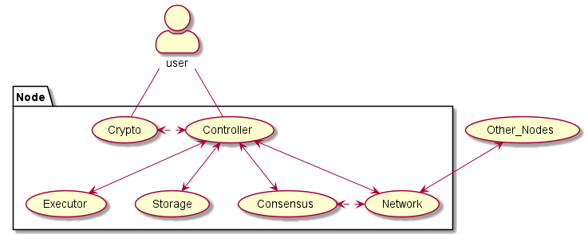
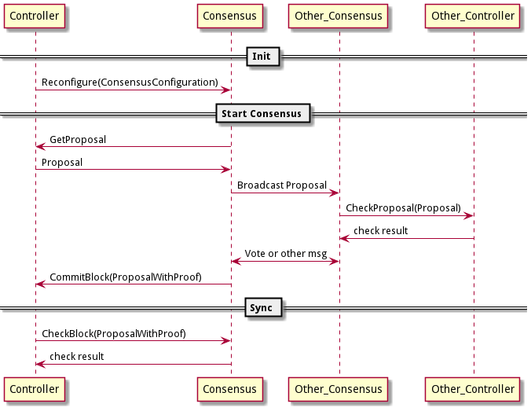

# 架构设计

`CITA-Cloud`总体设计上采用微服务架构，划分为`Controller`，`Network`，`Consensus`，`Storage`，`Executor`，`Crypto`六个微服务。



**微服务架构图**

微服务接口定义参见[cita_cloud_proto](https://github.com/cita-cloud/cita_cloud_proto)。

微服务之间相互解耦，达到不同实现可以灵活替换，自由组合的目的。解耦设计的细节参见[底层链技术白皮书](https://talk.citahub.com/t/topic/1663)。

为了能够快速构建起完整的，成熟的生态。在之前解耦的基础上，让解耦出的每一个微服务都能独立完成某项功能，每个微服务的接口能够自洽。使其不只是作为`CITA-Cloud`的组件存在，还可以拥有自己独立的生态。

## Network

`Network`微服务，维护与其他节点之间的网络连接，为本节点的其他微服务提供网络服务。

主要功能有收/发网络消息和节点管理，状态查询。

### 接收网络消息

收的部分采用了控制反转，收到的网络消息根据消息头中的`module`字段分发到其他微服务，并通过回调其他微服务的`gRPC`接口的方式在微服务间传递网络消息。

因此只有一个注册接口，用于其他需要网络服务的微服务注册信息。

```
// 注册网络服务接口
rpc RegisterNetworkMsgHandler(RegisterInfo) returns (common.StatusCode);

// 注册网络服务所需的信息
message RegisterInfo {
    string module_name = 1;  // 微服务名称
    string hostname = 2;     // 网络消息分发时，回调地址的域名
    string port = 3;         // 网络消息分发时，回调地址的端口
}

// 网络消息分发时，回调的 gRPC 接口
// 注册网络服务的其他微服务必须实现该接口
service NetworkMsgHandlerService {
    rpc ProcessNetworkMsg(NetworkMsg) returns (common.StatusCode);
}

// 网络消息结构
message NetworkMsg {
    string module = 1;  // 接收的微服务名称
    string type = 2;    // 消息类型，用于在同一个微服务内区分不同的消息
    uint64 origin = 3;  // 消息的节点标识
    bytes msg = 4;      // 消息数据
}
```

### 发送网络消息
发的部分提供了单播(`SendMsg`)和广播(`Broadcast`)两个接口。

```
// 发送消息给一个特定的节点
// 通过消息中的 origin 字段指定接收节点的标识
rpc SendMsg(NetworkMsg) returns (common.StatusCode);

// 广播消息
// 消息中的 origin 字段被忽略
rpc Broadcast(NetworkMsg) returns (common.StatusCode);
```

关于消息中的`origin`字段，在收到网络消息之后，需要对其进行一个处理。

发送时填的是接收节点的标识，接收到之后会将该字段修改为发送节点的标识。

### 状态查询

```
message NetworkStatusResponse {
    uint64 peer_count = 1;
}

rpc GetNetworkStatus(common.Empty) returns (NetworkStatusResponse);
```

查询网络连接状态的接口，返回当前连接的节点数量。

注意，这个数量里不包括节点自身。因此，4个子节点的链，正常查询结果是3。


```
message NodeNetInfo {
    string multi_address = 1;
    uint64 origin = 2;
}

message TotalNodeNetInfo {
    repeated NodeNetInfo nodes = 1;
}

rpc GetPeersNetInfo(common.Empty) returns (common.TotalNodeNetInfo);
```

查询节点网络信息的接口，返回连接的邻居节点的网络地址和标识信息。

注意：网络微服务的实现可以是任意的网络协议，为了兼容不同的协议，这里展示用的是[multi_address](https://multiformats.io/multiaddr/)。

### 节点管理

```
message NodeNetInfo {
    string multi_address = 1;
    uint64 origin = 2;
}

rpc AddNode(common.NodeNetInfo) returns (common.StatusCode);
```

增加节点信息的接口(`AddNode`)，用于临时增加一个节点到网络中。

### 发展方向

独立出该微服务的初衷是网络部分比较复杂，希望该服务能隔离这部分复杂性，其他微服务就可以不用关心网络的具体情况。因此，其实现会朝着如下方向发展：

1. 处理复杂的网络场景。比如，`p2p`，防火墙穿透，虚拟私有网络等场景。
2. 对接多种协议。比如，`TCP`，`UDP`等。
3. 提供更高的可靠性。比如，提供重发，限流，`QoS`，保证消息到达且仅到达一次等。

## Storage

`Storage`微服务，主要提供`KV`存储相关的功能，涵盖了常用的增删改查功能。

用于保存交易，区块和一些链相关的全局信息。

### 存储分区
针对区块链业务，预先定义了不同的`region`，将不同类别的数据分别存放：

```
enum Regions {
    GLOBAL = 0;
    TRANSACTIONS = 1;
    HEADERS = 2;
    BODIES = 3;
    BLOCK_HASH = 4;
    PROOF = 5;
    RESULT = 6;
    TRANSACTION_HASH2BLOCK_HEIGHT = 7;
    BLOCK_HASH2BLOCK_HEIGHT = 8;  // In SQL db, reuse 4
    TRANSACTION_INDEX = 9;
    COMPACT_BLOCK = 10;
    FULL_BLOCK = 11;
    BUTTON = 12;
}
```

`GLOBAL` 保存链相关的全局信息，比如当前链的最新高度，当前链的最新区块`Hash`等，对应的`key`为自定义的固定值。

`TRANSACTIONS` 保存 交易哈希 -> 交易原始数据 的对应关系。

`HEADERS` 保存 区块高度 -> 区块头数据 的对应关系。

`BODIES` 保存 区块高度 -> 区块体数据 的对应关系。

`BLOCK_HASH` 保存 区块高度 -> 区块哈希 的对应关系。

`PROOF` 保存 区块高度 -> 区块证明 的对应关系。

`RESULT` 保存 区块高度 -> 区块执行结果 的对应关系。

`TRANSACTION_HASH2BLOCK_HEIGHT` 保存 交易哈希 -> 交易所在区块高度 的对应关系。

`BLOCK_HASH2BLOCK_HEIGHT` 保存 区块哈希 -> 区块高度 的对应关系。即 `BLOCK_HASH` 的反查。

`TRANSACTION_INDEX` 保存 交易哈希 -> 交易在所在区块中的序号 的对应关系。

`COMPACT_BLOCK` 保存 区块高度 -> 紧凑区块 的对应关系。

`FULL_BLOCK` 保存 区块高度 -> 完整区块 的对应关系。

定制开发者可以根据自己的需要调整`region`列表。

### store

```
message Content {
    uint32 region = 1;
    bytes key = 2;
    bytes value = 3;
}

// store key/value
rpc Store(Content) returns (common.StatusCode);
```

其中`region`即前述存储分区的枚举值。

注意:
1. `key`和`value`类型为`bytes`，需要调用方提前进行类型转换。
2. 其语义是`updata`，同时包含增和改的功能。

### load

```
message ExtKey {
    uint32 region = 1;
    bytes key = 2;
}

message Value {
    common.StatusCode status = 1;
    bytes value = 2;
}

// given a ext key return value
rpc Load(ExtKey) returns (Value);
```

### delete

```
message ExtKey {
    uint32 region = 1;
    bytes key = 2;
}

// given a ext key delete it
rpc Delete(ExtKey) returns (common.StatusCode);
}
```

### 发展方向

联盟链的存储压力相较公链会大很多，可靠性要求也更高。因此，其实现会朝着如下方向发展：

1. 大数据量。比如，分布式数据库。
2. 更多功能。比如，冷热数据分离，备份等。

## Crypto

`Crypto`微服务，主要提供其他微服务需要的密码学服务。

目前提供区块链最基础的签名和哈希服务。

### GetCryptoInfo

```
message GetCryptoInfoResponse {
    common.StatusCode status = 1;
    string name = 2;
    uint32 hash_len = 3;
    uint32 signature_len = 4;
    uint32 address_len = 5;
}

// Get crypto info
rpc GetCryptoInfo(common.Empty) returns (GetCryptoInfoResponse);
```

查询结果：
1. `name` 算法组合的名称。
2. `hash_len` 哈希算法得出的哈希值的字节长度。
3. `signature_len` 签名算法得出的签名的字节长度。
4. `address_len` 账户地址的字节长度。

### 签名

```
message SignMessageRequest {
    bytes msg = 2;
}

message SignMessageResponse {
    common.StatusCode status = 1;
    bytes signature = 2;
}

// Sign a message
rpc SignMessage(SignMessageRequest) returns (SignMessageResponse);
```

本接口入参为签名所使用的账户的序号和要签名的消息，返回数字签名。

```
message RecoverSignatureRequest {
    bytes msg = 1;
    bytes signature = 2;
}

message RecoverSignatureResponse {
    common.StatusCode status = 1;
    bytes address = 2;
}

// Recover signature
rpc RecoverSignature(RecoverSignatureRequest) returns (RecoverSignatureResponse);
```

本接口入参为消息和其对应的数字签名，返回执行签名的账户地址。

注意：从接口定义看，似乎只能支持能恢复出公钥的签名算法。但是实际上可以把公钥附在签名后面，模拟出能恢复出公钥的签名算法。

### 哈希

```
message HashDataRequest {
    bytes data = 1;
}

message Hash {
    bytes hash = 1;
}

message HashResponse {
    StatusCode status = 1;
    Hash hash = 2;
}

// Hash data
rpc HashData(HashDataRequest) returns (common.HashResponse);
```

本接口入参为要哈希的数据，返回哈希值。

```
message VerifyDataHashRequest {
    bytes data = 1;
    bytes hash = 2;
}

// Verify hash of data
rpc VerifyDataHash(VerifyDataHashRequest) returns (common.StatusCode);
```

本接口入参为要哈希的数据和相应的哈希值，返回校验结果。

### CheckTransactions

```
// check transactions
rpc CheckTransactions(blockchain.RawTransactions) returns (common.StatusCode);
```

本接口用于批量校验交易。

因为交易验证过程中设计大量的密码学校验，如果每次都发起`rpc`调用性能会比较差。

可以认为是一个特殊的批量调用接口。

### 发展方向

密码学在区块链中至关重要，独立出该微服务的初衷是将系统与所使用的密码学算法解耦，方便将来替换密码学算法。

因此，其实现会朝着如下方向发展：

1. 新密码学算法的支持。比如，更加安全，更加高效的密码学算法。
2. 更多密码学相关功能集成。比如，对称加密，零知识证明等。

## Executor

`Executor`微服务，提供智能合约能力。

根据交易内容执行对应的智能合约，改变链上状态或者查询链上状态的。

### Exec

```
// exec a block return executed_block_hash
rpc Exec(blockchain.Block) returns (common.HashResponse);
```

本接口入参为一个完整的区块数据，返回执行完区块中所有交易后的状态结果。

此结果数据类型为哈希值，类似以太坊的`state_root`。


### Call

```
message CallRequest {
    bytes to = 1;
    bytes from = 2;
    bytes method = 3;
    repeated bytes args = 4;
}

message CallResponse {
    bytes value = 1;
}

rpc Call(CallRequest) returns (CallResponse);
```

合约查询功能，调用合约中的指定方法，返回调用该方法的返回值。

### 发展方向

智能合约是区块链在可编程性方面很重要的功能。

该微服务只做了非常粗粒度的抽象，至于实现的细节，比如采用何种`VM`；状态有哪些内容；状态如何组织和保存，都由具体实现来决定。

其实现会朝着如下方向发展：

1. 移植有广泛智能合约生态的引擎。比如，以太坊的`EVM`。
2. 提供通用语言的`Runtime`，使得用户可以用通用编程语言编写智能合约，降低合约开发门槛。
3. 针对一些特定应用场景，提供特定的`VM`和智能合约编程语言。比如可信计算，隐私计算，数据格式转换等。

## Consensus

`Consensus`微服务，主要提供让提案在多个共识参与方之间达成一致的功能。

单独这个微服务的功能，可以认为是一个分歧解决机。



**共识微服务时序图**

### 获取本节点提案

```
message Proposal {
    uint64 height = 1;
    bytes data = 2;
}

message ProposalResponse {
    StatusCode status = 1;
    Proposal proposal = 2;
}

rpc GetProposal(common.Empty) returns (common.ProposalResponse);
```

该接口实现在`Controller`微服务中,`Consensus`微服务去调用。

返回的提案数据类型为`bytes`，因为`Consensus`微服务不需要了解提案的具体内容。

### 检查其他节点的提案

```
rpc CheckProposal(common.Proposal) returns (common.StatusCode);
```

该接口实现在`Controller`微服务中,`Consensus`微服务去调用。

当本节点的`Consensus`微服务收到其他节点发送的提案，调用该接口检查提案是否合法。

### 提交共识结果

```
message ProposalWithProof {
    Proposal proposal = 1;
    bytes proof = 2;
}

message ConsensusConfiguration {
    uint64 height = 1;
    uint32 block_interval = 2;
    repeated bytes validators = 3;
}

message ConsensusConfigurationResponse {
    StatusCode status = 1;
    ConsensusConfiguration config = 2;
}

rpc CommitBlock(common.ProposalWithProof) returns (common.ConsensusConfigurationResponse);
```

该接口实现在`Controller`微服务中,`Consensus`微服务去调用。

共识达成之后，提交经过共识的提案以及相关证明，例如投票信息等。

`Controller`微服务会给`Consensus`微服务返回新的配置信息。

目前配置信息包括:
1. 出块间隔。
2. 共识参与方账户地址列表。

### 检查同步的提案

```
rpc CheckBlock(common.ProposalWithProof) returns (common.StatusCode);
```

该接口实现在`Consensus`微服务中,`Controller`微服务调用。

本节点进度落后的时候，`Controller`微服务会从其他节点同步已经共识过的提案及相关的证明。

`Controller`微服务本身无法验证证明是否合法，只能交由`Consensus`微服务来验证。

### 配置变更

```
rpc Reconfigure(common.ConsensusConfiguration) returns (common.StatusCode);
```

该接口实现在`Consensus`微服务中,`Controller`微服务调用。


### 发展方向

共识是区块链非常核心的功能，但是共识算法实现非常多样化。

该微服务尽量做到抽象，以适应不同的共识算法。

其实现会朝着如下方向发展：

1. 更新更高效的共识算法。
2. 针对一些特定应用场景。比如非拜占庭容错的共识算法等。

## Controller

`Controller`微服务在整个区块链中处于核心的位置，主导所有主要的流程，并给上层用户提供`RPC`接口。

接口除了前述的针对`Consensus`微服务的接口，就是针对上层用户的`RPC`接口。其中最重要的是`SendRawTransaction`发送交易接口，剩下的都是一些信息查询接口。

单独就这个微服务来说，可以认为是一个提案管理系统。用户通过发送交易接口，提交原始交易数据，`Controller`管理这些原始交易数据。通过计算原始交易数据的哈希，组装成区块，并形成`Consensus`需要的提案，管理这些提案。这里所说的管理，包括持久化，同步，以及验证其合法性。

`Blockchain.proto`文件中定义了一套交易和区块的数据结构，但是前面所述的从原始交易数据如何产生最终`Consensus`需要的提案，并且这个过程还是要可验证的，这些都由具体实现决定。

### 发展方向

`Controller`微服务是整个区块链系统的控制中枢，其内部逻辑和流程非常复杂，可定制部分也比较多。

未来我们会进一步梳理该微服务，并尝试提供一个框架，方便用户自定义流程，甚至是自定义交易和块等核心数据结构。
